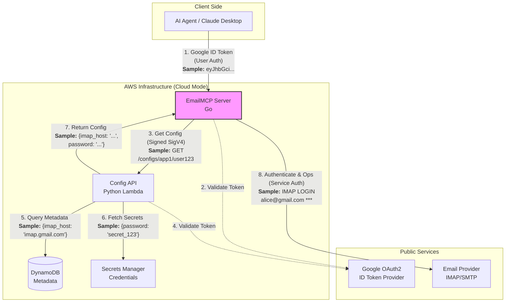

# EmailMCP

A production-grade **Model Context Protocol (MCP)** server written in Go that exposes full email capabilities (IMAP + SMTP) as MCP tools for AI agents.

## Features

### IMAP (Inbound)
- Secure AES-256-GCM encrypted credential storage (Standalone) or AWS Secrets Manager (Cloud)
- Robust per-account IMAP connection pooling with health checks and limits
- List folders
- Search emails (text, from, since, etc.)
- Read full emails (envelope + body + attachment metadata)
- Move, flag, and delete (single and bulk)

### Multi-User & Cloud Architecture
- **Google OAuth2 Authentication**: Secure multi-user isolation using Google ID tokens.
- **Hybrid Storage Model**: General configuration in Amazon DynamoDB and sensitive credentials in AWS Secrets Manager.
- **AWS CDK Infrastructure**: Fully automated resource provisioning using TypeScript.
- **Config API Layer**: Lightweight Python Lambda gateway for configuration management.

### SMTP (Outbound)
- Send plain text + HTML emails
- Attachments (base64 in tool calls)
- Per-account SMTP configuration with TLS support

### Multi-Account & Security
- Unified account model for IMAP + SMTP
- All operations scoped by `account_id`
- Master key from `EMAILMCP_MASTER_KEY` (never logged)
- Pure Go SQLite storage

## Requirements

- Go 1.25+ (due to MCP SDK)
- Node.js & npm (for CDK infrastructure)
- Python 3.12 (for Config API Lambda)
- AWS CLI configured with appropriate credentials
- A 32-byte base64 master encryption key (for standalone mode)

## Quick Start (Cloud Deployment)

The cloud deployment provisions a multi-user environment using AWS CDK.

```bash
# 1. Setup environment
./run.sh setup

# 2. Deploy to AWS
# Replace YOUR_GOOGLE_CLIENT_ID with your real Google OAuth2 Client ID
./run.sh deploy cloud dev --context googleClientId=YOUR_GOOGLE_CLIENT_ID
```

The `run.sh` script automates building the Go binary, packaging the Lambda, and deploying the CDK stack. After deployment, note the `ConfigApiUrl` output for your MCP server configuration.

## Standalone Quick Start

```bash
# 1. Clone and build
git clone https://github.com/jpuckett/EmailMCP
cd EmailMCP/emailmcp
go mod tidy
go build -o emailmcp ./cmd/emailmcp

# 2. Generate master key
openssl rand -base64 32
# Copy the output

# 3. Configure
cp .env.example .env
# Edit .env and set EMAILMCP_MASTER_KEY

# 4. Run
./run.sh run
```

The server listens on `:8080` by default and serves the Streamable HTTP transport at `/`.

### Installation (System-wide)

If you want to install EmailMCP to your system:

```bash
./run.sh install
```

This will:
- Build and install the binary to `/usr/local/bin/emailmcp-bin`
- Install a wrapper script to `/usr/local/bin/emailmcp`

The wrapper script automatically loads configuration from `~/.emailmcp`. You should create this file manually with your environment variables:

```bash
# Example ~/.emailmcp
EMAILMCP_MASTER_KEY=your-32-byte-base64-key
EMAILMCP_DB_PATH=/Users/youruser/.emailmcp.db
```

### Cloud Deployment Configuration

When deploying to AWS, the following environment variables can be set in `emailmcp/.env` or your shell:

- `AWS_REGION`: The AWS region to deploy the infrastructure to (defaults to your AWS CLI configuration).
- `GOOGLE_CLIENT_ID`: Your Google OAuth2 Client ID for user authentication.
- `EKS_OIDC_PROVIDER_ARN`: (EKS Mode) The ARN of your cluster's IAM OIDC provider. If not set, the script will attempt to detect it from the current kubectl context.
- `EKS_CERTIFICATE_ARN`: (EKS Mode) The ARN of the SSL certificate for the ALB Ingress. If not set, the script will attempt to retrieve it from the CDK outputs.

Example:
```bash
EKS_OIDC_PROVIDER_ARN=arn:aws:iam::123456789012:oidc-provider/oidc.eks.us-east-1.amazonaws.com/id/EXAMPLEDATA ./run.sh eks-deploy
```

To remove the deployment from EKS:
```bash
./run.sh undeploy-eks
```

## MCP Tools

| Tool                  | Description                              |
|-----------------------|------------------------------------------|
| `add_email_account`   | Add IMAP + SMTP account (creds encrypted)|
| `list_email_accounts` | List accounts (no secrets)               |
| `remove_email_account`| Delete account                           |
| `list_folders`        | List IMAP mailboxes                      |
| `search_emails`       | Search folder (summaries)                |
| `read_email`          | Fetch full message by UID                |
| `move_emails`         | Bulk move UIDs                           |
| `flag_emails`         | Add/remove flags                         |
| `delete_emails`       | Mark emails deleted                      |
| `send_email`          | Send message (text/HTML + attachments)   |

All email tools require `account_id`.

## Configuration

EmailMCP can run in two modes: **Standalone** (local SQLite) or **Cloud** (DynamoDB + Secrets Manager).

### Cloud Deployment Variables

When deploying the infrastructure, you must provide the following CDK context:

| Variable | Description |
|----------|-------------|
| `googleClientId` | Your Google OAuth2 Client ID for token verification. |

### Environment Variables

See `.env.example`. Key variables for the MCP server:

#### Global Variables
| Variable | Required | Description |
|----------|----------|-------------|
| `EMAILMCP_MASTER_KEY` | Yes | 32-byte base64 key for local credential encryption. |
| `EMAILMCP_LOG_LEVEL` | No | `debug`, `info` (default), `warn`, `error`. |
| `EMAILMCP_TRANSPORT` | No | `http` (default) or `stdio`. |

#### Cloud Mode Variables
| Variable | Required | Description |
|----------|----------|-------------|
| `CONFIG_API_URL` | Yes | The URL from the CDK deployment output. |
| `GOOGLE_CLIENT_ID` | Yes | The same Google Client ID used in deployment. |
| `APPLICATION_ID` | No | Unique ID for your application (default: `default`). |

#### Standalone Mode Variables
| Variable | Required | Description |
|----------|----------|-------------|
| `EMAILMCP_DB_PATH` | No | Path to SQLite database (default: `./emailmcp.db`). |
| `EMAILMCP_LISTEN_ADDR`| No | HTTP listen address (default: `:8080`). |

### IMAP & SMTP Tuning
- `EMAILMCP_IMAP_MAX_CONNS`: Max connections per account (default: 4).
- `EMAILMCP_IMAP_IDLE_TIMEOUT`: Connection idle timeout (default: 5m).
- `EMAILMCP_SMTP_TIMEOUT`: SMTP operation timeout (default: 30s).

## Docker

```bash
docker build -t emailmcp .
docker run -e EMAILMCP_MASTER_KEY=... -p 8080:8080 emailmcp
```

## EKS Deployment

EmailMCP can be deployed to Amazon EKS using the provided Kubernetes manifests and the `run.sh` helper script.

### Prerequisites

1.  An existing EKS cluster.
2.  `kubectl` configured to point to your cluster.
3.  `aws` CLI configured with appropriate permissions.
4.  Infrastructure deployed via CDK (to create ECR and Config API):
    ```bash
    ./run.sh deploy cloud
    ```

### Deployment Steps

1.  **Set Environment Variables**: Ensure `EMAILMCP_MASTER_KEY` and `GOOGLE_CLIENT_ID` are set in your environment or `.env` file.
2.  **Deploy to EKS**:
    ```bash
    ./run.sh eks-deploy
    ```
    This command will:
    - Automatically detect your EKS cluster's OIDC Provider.
    - Provision an IAM Role for Service Accounts (IRSA) via CDK.
    - Build the Docker image and push it to the ECR repository.
    - Deploy a `ServiceAccount` annotated with the IAM Role.
    - Deploy the `Deployment` using the `ServiceAccount`, eliminating the need for static AWS Access Keys.
    - Deploy an AWS Application Load Balancer (ALB) via `Ingress` configured for `emailmcp.ecg.co`.

3.  **Verify Deployment**:
    ```bash
    ./run.sh eks-status
    ```

4.  **Access the Server**:
    The service is exposed via an AWS Application Load Balancer (ALB) at `http://emailmcp.ecg.co`. Ensure your DNS or `/etc/hosts` points `emailmcp.ecg.co` to the ALB's external DNS name (found in `eks-status`).

### Persistent Storage

In EKS, the server uses an `emptyDir` for the `/data` directory by default. This means the local SQLite database is cleared when a pod restarts. In **Cloud Mode**, this is usually acceptable as account configurations are stored in DynamoDB and fetched dynamically. If you need persistence for the local SQLite database, you should modify `deploy/eks/deployment.yaml` to use a PersistentVolumeClaim.

## Claude Desktop Integration

To use EmailMCP with Claude Desktop, add the following to your configuration file:

- **macOS**: `~/Library/Application Support/Claude/claude_desktop_config.json`
- **Windows**: `%APPDATA%\Claude\claude_desktop_config.json`

If you have performed the [System-wide Installation](#installation-system-wide), the configuration is simple as the wrapper script handles the environment:

```json
{
  "mcpServers": {
    "emailmcp": {
      "command": "/usr/local/bin/emailmcp",
      "args": ["-transport", "stdio"]
    }
  }
}
```

Otherwise, you can run it from your source directory (requires absolute paths):

```json
{
  "mcpServers": {
    "emailmcp": {
      "command": "/absolute/path/to/EmailMCP/emailmcp",
      "args": ["-transport", "stdio"],
      "env": {
        "EMAILMCP_MASTER_KEY": "your-32-byte-base64-key",
        "EMAILMCP_DB_PATH": "/absolute/path/to/EmailMCP/emailmcp.db"
      }
    }
  }
}
```

## Architecture

### System Diagram

The following diagram illustrates the interaction between components in a **Cloud Deployment**, highlighting the user and service authentication flows.



### Cloud Components

EmailMCP is ready for cloud-native deployment with the following components:

- **Go MCP Server**: Validates Google ID tokens and dynamically fetches per-user configuration.
- **Python Config API (AWS Lambda)**: Serves as a secure gateway between the MCP server and storage, protected by AWS IAM authentication.
- **Hybrid Storage**:
  - **DynamoDB**: Stores non-sensitive user metadata and IMAP server settings.
  - **Secrets Manager**: Securely stores IMAP passwords, indexed by `applicationId` and `userId`.
- **AWS CDK**: Defines and provisions all resources including KMS keys for encryption, IAM roles for least-privilege access, and CloudTrail for audit logging.

For more details on the deployment process, see the root-level `run.sh` script and the `infrastructure/` directory.

### Project Structure

```
emailmcp/
  cmd/emailmcp          - Entry point
  internal/
    crypto/             - AES-256-GCM service
    store/              - SQLite account persistence
    imap/               - Connection pool + operations (go-imap/v2)
    smtp/               - Sending logic (jordan-wright/email)
    server/             - MCP server + tool registration
    config/             - Env-based configuration
    types/              - Shared domain types
```

## Development

```bash
go test ./...
go vet ./...
go build ./...
```

## Security Notes

- Never log decrypted credentials or full email bodies in production.
- Master key must be provided via environment only.
- Use TLS for IMAP/SMTP in production.
- Consider running behind a reverse proxy with auth if exposing publicly.

## License

MIT
