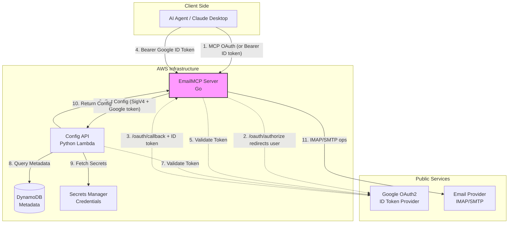

# EmailMCP

A production-grade **Model Context Protocol (MCP)** server written in Go that exposes full email capabilities (IMAP + SMTP) as MCP tools for AI agents.

## Features

### IMAP (Inbound)
- Credentials loaded from AWS Secrets Manager via the Config API
- Robust per-account IMAP connection pooling with health checks and limits
- List folders
- Search emails (text, from, since, etc.)
- Read full emails (envelope + body + attachment metadata)
- Move, flag, and delete (single and bulk)

### Multi-User & Cloud Architecture
- **Google OAuth2 Authentication**: MCP OAuth 2.1 discovery + authorization-code flow that fronts Google sign-in; Google ID tokens authorize MCP traffic.
- **Remote Storage**: Account configuration in Amazon DynamoDB and sensitive credentials in AWS Secrets Manager.
- **AWS CDK Infrastructure**: Fully automated resource provisioning using TypeScript.
- **Config API Layer**: Lightweight Python Lambda gateway for configuration management.

### SMTP (Outbound)
- Send plain text + HTML emails
- Attachments (base64 in tool calls)
- Per-account SMTP configuration with TLS support

### Multi-User Security
- One email account config per authenticated Google user
- Google ID token required on MCP HTTP traffic
- No local database or master encryption key

## Requirements

- Go 1.25+ (due to MCP SDK)
- Node.js & npm (for CDK infrastructure)
- Python 3.12 (for Config API Lambda)
- AWS CLI configured with appropriate credentials
- Google OAuth2 Client ID
- Config API URL (from CDK deploy, or resolvable via SSM)

## Quick Start (Cloud Deployment)

The cloud deployment provisions a multi-user environment using AWS CDK.

```bash
# 1. Setup environment
./run.sh setup

# 2. Deploy to AWS
# Replace YOUR_GOOGLE_CLIENT_ID with your real Google OAuth2 Client ID
./run.sh deploy cloud dev --context googleClientId=YOUR_GOOGLE_CLIENT_ID
```

The `run.sh` script automates building the Go binary, packaging the Lambda, and deploying the CDK stack. After deployment, note the `ConfigApiUrl` output for your MCP server configuration.

## Local Quick Start

```bash
# 1. Clone and build
git clone https://github.com/jpuckett/EmailMCP
cd EmailMCP/emailmcp
go mod tidy
go build -o emailmcp ./cmd/emailmcp

# 2. Configure
cp .env.example .env
# Edit .env and set CONFIG_API_URL, GOOGLE_CLIENT_ID, GOOGLE_CLIENT_SECRET,
# and PUBLIC_BASE_URL (CONFIG_API_URL can also be resolved from SSM)

# 3. Run
./run.sh run
```

The server listens on `:8080` by default and serves the Streamable HTTP transport at `/`. Startup refuses to serve if the Config API health check fails.

### Installation (System-wide)

If you want to install EmailMCP to your system:

```bash
./run.sh install
```

This will:
- Build and install the binary to `/usr/local/bin/emailmcp-bin`
- Install a wrapper script to `/usr/local/bin/emailmcp`

The wrapper script automatically loads configuration from `~/.emailmcp`. You should create this file manually with your environment variables:

```bash
# Example ~/.emailmcp
CONFIG_API_URL=https://your-config-api.lambda-url.region.on.aws/
GOOGLE_CLIENT_ID=your-google-client-id.apps.googleusercontent.com
GOOGLE_CLIENT_SECRET=your-google-client-secret
PUBLIC_BASE_URL=https://emailmcp.ecg.co
APPLICATION_ID=default
```

### Cloud Deployment Configuration

When deploying to AWS, the following environment variables can be set in `emailmcp/.env` or your shell:

- `AWS_REGION`: The AWS region to deploy the infrastructure to (defaults to your AWS CLI configuration).
- `GOOGLE_CLIENT_ID`: Your Google OAuth2 Client ID for user authentication.
- `GOOGLE_CLIENT_SECRET`: Google OAuth client secret (HTTP/MCP OAuth flow).
- `PUBLIC_BASE_URL`: Public origin of the MCP server (default for EKS: `https://emailmcp.ecg.co`).
- `EKS_OIDC_PROVIDER_ARN`: (EKS Mode) The ARN of your cluster's IAM OIDC provider. If not set, the script will attempt to detect it from the current kubectl context.
- `EKS_CERTIFICATE_ARN`: (EKS Mode) The ARN of the SSL certificate for the ALB Ingress. If not set, the script will attempt to retrieve it from the CDK outputs.

Example:
```bash
EKS_OIDC_PROVIDER_ARN=arn:aws:iam::123456789012:oidc-provider/oidc.eks.us-east-1.amazonaws.com/id/EXAMPLEDATA ./run.sh eks-deploy
```

To remove the deployment from EKS:
```bash
./run.sh undeploy-eks
```

## MCP Tools

| Tool                  | Description                                              |
|-----------------------|----------------------------------------------------------|
| `add_email_account`   | Create/replace the user's IMAP + SMTP account (Config API)|
| `list_email_accounts` | List the user's account (no secrets)                     |
| `remove_email_account`| Delete the user's account config                         |
| `list_folders`        | List IMAP mailboxes                                      |
| `search_emails`       | Search folder (summaries)                                |
| `read_email`          | Fetch full message by UID                                |
| `move_emails`         | Bulk move UIDs                                           |
| `flag_emails`         | Add/remove flags                                         |
| `delete_emails`       | Mark emails deleted                                      |
| `send_email`          | Send message (text/HTML + attachments)                   |

Account tools operate on the authenticated user's single config (keyed by Google `sub`).

## Configuration

EmailMCP uses **remote account storage only** (Config API → DynamoDB + Secrets Manager).

### Cloud Deployment Variables

When deploying the infrastructure, you must provide the following CDK context:

| Variable | Description |
|----------|-------------|
| `googleClientId` | Your Google OAuth2 Client ID for token verification. |

### Environment Variables

See `.env.example`. Key variables for the MCP server:

| Variable | Required | Description |
|----------|----------|-------------|
| `CONFIG_API_URL` | Yes* | Config API Function URL. *May be resolved from SSM `/emailmcp/config-api/url`. |
| `GOOGLE_CLIENT_ID` | Yes | Google OAuth2 Client ID for ID token verification. |
| `GOOGLE_CLIENT_SECRET` | Yes (HTTP) | Google client secret for the MCP OAuth authorize/token proxy. |
| `PUBLIC_BASE_URL` | Yes (HTTP) | Public origin (issuer + OAuth redirect base), e.g. `https://emailmcp.ecg.co`. |
| `APPLICATION_ID` | No | Application partition key (default: `default`). |
| `EMAILMCP_LOG_LEVEL` | No | `debug`, `info` (default), `warn`, `error`. |
| `EMAILMCP_TRANSPORT` | No | `http` (default) or `stdio`. |
| `EMAILMCP_LISTEN_ADDR` | No | HTTP listen address (default: `:8080`). |

### IMAP & SMTP Tuning
- `EMAILMCP_IMAP_MAX_CONNS`: Max connections per account (default: 4).
- `EMAILMCP_IMAP_IDLE_TIMEOUT`: Connection idle timeout (default: 5m).
- `EMAILMCP_SMTP_TIMEOUT`: SMTP operation timeout (default: 30s).

## Docker

```bash
docker build -t emailmcp .
docker run \
  -e CONFIG_API_URL=... \
  -e GOOGLE_CLIENT_ID=... \
  -e GOOGLE_CLIENT_SECRET=... \
  -e PUBLIC_BASE_URL=https://emailmcp.ecg.co \
  -e AWS_REGION=us-east-1 \
  -p 8080:8080 emailmcp
```

The container needs AWS credentials (or IRSA on EKS) to call the Config API Function URL with SigV4.

## EKS Deployment

EmailMCP can be deployed to Amazon EKS using the provided Kubernetes manifests and the `run.sh` helper script.

### Prerequisites

1.  An existing EKS cluster.
2.  `kubectl` configured to point to your cluster.
3.  `aws` CLI configured with appropriate permissions.
4.  Infrastructure deployed via CDK (to create ECR and Config API):
    ```bash
    ./run.sh deploy cloud
    ```

### Deployment Steps

1.  **Set Environment Variables**: Ensure `GOOGLE_CLIENT_ID`, `GOOGLE_CLIENT_SECRET`, and optionally `PUBLIC_BASE_URL` are set in your environment or `.env` file. In Google Cloud Console, add authorized redirect URI `{PUBLIC_BASE_URL}/oauth/callback` (e.g. `https://emailmcp.ecg.co/oauth/callback`).
2.  **Deploy to EKS**:
    ```bash
    ./run.sh eks-deploy
    ```
    This command will:
    - Automatically detect your EKS cluster's OIDC Provider.
    - Provision an IAM Role for Service Accounts (IRSA) via CDK.
    - Build the Docker image and push it to the ECR repository.
    - Deploy a `ServiceAccount` annotated with the IAM Role.
    - Deploy the `Deployment` using the `ServiceAccount`, eliminating the need for static AWS Access Keys.
    - Deploy an AWS Application Load Balancer (ALB) via `Ingress` configured for `emailmcp.ecg.co`.

3.  **Verify Deployment**:
    ```bash
    ./run.sh eks-status
    ```

4.  **Access the Server**:
    The service is exposed via an AWS Application Load Balancer (ALB) at `http://emailmcp.ecg.co`. Ensure your DNS or `/etc/hosts` points `emailmcp.ecg.co` to the ALB's external DNS name (found in `eks-status`).

Account configuration is always remote (DynamoDB / Secrets Manager via Config API). The pod is stateless — no persistent volume is required for account data.

## Claude Desktop Integration

To use EmailMCP with Claude Desktop, add the following to your configuration file:

- **macOS**: `~/Library/Application Support/Claude/claude_desktop_config.json`
- **Windows**: `%APPDATA%\Claude\claude_desktop_config.json`

If you have performed the [System-wide Installation](#installation-system-wide), the configuration is simple as the wrapper script handles the environment:

```json
{
  "mcpServers": {
    "emailmcp": {
      "command": "/usr/local/bin/emailmcp",
      "args": ["-transport", "stdio"]
    }
  }
}
```

Otherwise, you can run it from your source directory (requires absolute paths):

```json
{
  "mcpServers": {
    "emailmcp": {
      "command": "/absolute/path/to/EmailMCP/emailmcp",
      "args": ["-transport", "stdio"],
      "env": {
        "CONFIG_API_URL": "https://your-config-api.lambda-url.region.on.aws/",
        "GOOGLE_CLIENT_ID": "your-google-client-id.apps.googleusercontent.com"
      }
    }
  }
}
```

Note: HTTP mode with a Google ID token is the supported multi-user path. Stdio does not apply the HTTP auth middleware.

## Architecture

### System Diagram

The following diagram illustrates the interaction between components, highlighting the user and service authentication flows.



### Cloud Components

EmailMCP is ready for cloud-native deployment with the following components:

- **Go MCP Server**: Validates Google ID tokens and dynamically fetches per-user configuration.
- **Python Config API (AWS Lambda)**: Serves as a secure gateway between the MCP server and storage, protected by AWS IAM authentication.
- **Hybrid Storage**:
  - **DynamoDB**: Stores non-sensitive user metadata and IMAP/SMTP server settings.
  - **Secrets Manager**: Securely stores IMAP passwords, indexed by `applicationId` and `userId`.
- **AWS CDK**: Defines and provisions all resources including KMS keys for encryption, IAM roles for least-privilege access, and CloudTrail for audit logging.

For more details on the deployment process, see the root-level `run.sh` script and the `infrastructure/` directory.

### Project Structure

```
emailmcp/
  cmd/emailmcp          - Entry point
  internal/
    config/             - Env config + Config API client (SigV4)
    imap/               - Connection pool + operations (go-imap/v2)
    smtp/               - Sending logic (jordan-wright/email)
    server/             - MCP server, Google auth, tool registration
    types/              - Shared domain types
```

## Development

```bash
go test ./...
go vet ./...
go build ./...
```

## Security Notes

- Never log credentials or full email bodies in production.
- Account secrets live only in Secrets Manager; EmailMCP does not persist them.
- Use TLS for IMAP/SMTP in production.
- Consider running behind a reverse proxy if exposing publicly; MCP routes already require Google ID tokens.
